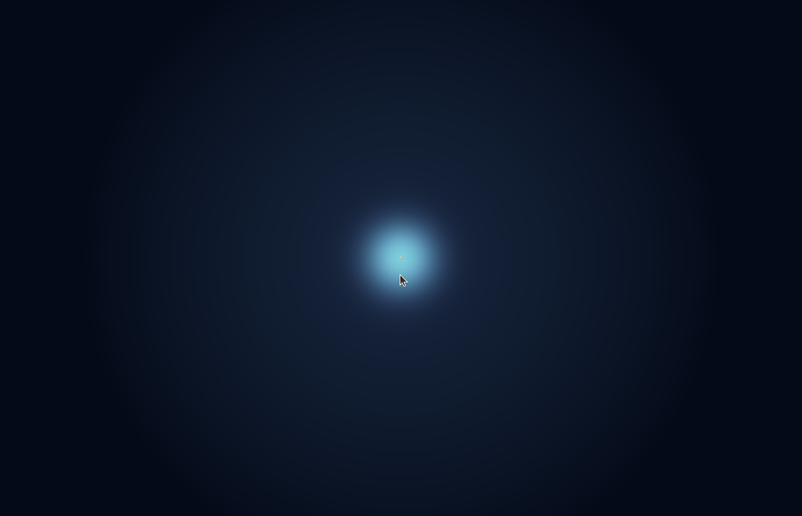

# Baseline Atom: quantum-to-world origin

Status: executable hydrogen baseline  
Primary graph: `baseline/baseline-cuda.pqo`  
Compute targets: CUDA headless and CUDA/Vulkan

## Purpose

Pqo starts its multiscale evolution with one isolated neutral hydrogen atom.
Hydrogen is the correct first atom because the nonrelativistic Coulomb problem
has an analytic ground-state solution. The baseline therefore begins with a
known quantum state that can be checked numerically before adding interactions,
chemistry, molecular mechanics, fields, cells, or organisms.

The baseline must never depict an electron as a little body orbiting a nucleus.
Its primitive is:

```text
point nucleus + complex wavefunction + probability density + observables
```

## Exact model boundary

Within the time-independent, nonrelativistic Schrödinger equation, a fixed
point proton, no external field, and no spin coupling, the hydrogen `1s`
eigenstate is analytic:

```math
\psi_{100}(\mathbf r)
=
\frac{1}{\sqrt{\pi a_0^3}} e^{-r/a_0}
```

and its probability density is:

```math
\rho(\mathbf r)
= |\psi_{100}(\mathbf r)|^2
= \frac{1}{\pi a_0^3}e^{-2r/a_0}.
```

The exact analytic invariants used by the executable gate are:

```math
\int_{\mathbb R^3}\rho(\mathbf r)\,d^3r = 1,
\qquad
\langle r\rangle = \frac{3}{2}a_0.
```

The Bohr radius is the 2022 CODATA value:

```text
a0 = 5.291 772 105 44(82) × 10^-11 m
```

This is not an exact QED atom. It omits finite proton structure, proton recoil,
spin, fine and hyperfine structure, Lamb shift, radiative corrections, and
relativistic dynamics. Those effects require progressively richer Hamiltonians
and should be introduced as independently testable corrections—not hidden in
the visualization.

## Executable discretization

The CUDA baseline evaluates the analytic density on a cell-centred Cartesian
domain:

```text
resolution       100 × 100 × 100 = 1,000,000 samples
domain           [-8a0, +8a0]^3
precision        IEEE-754 f32
sampling         midpoint rule
leaf hierarchy   25 × 25 × 25 clusters
leaf extent      4 × 4 × 4 voxels
```

The finite cube and f32 reduction are approximations. They are acceptable only
while their errors remain explicit in:

- `metrics.total_probability`
- `metrics.radial_moment`

After each density evaluation, require approximately:

```text
metrics.total_probability = 1
metrics.radial_moment / metrics.total_probability = 1.5a0
```

The current RTX 5090 evidence is:

```text
integrated probability     0.99996793
computed mean radius       7.9378046e-11 m
analytic mean radius       7.9376582e-11 m
mean-radius relative error 1.84e-5
```

## What the Vulkan view means

The native Vulkan atom scene ray-integrates the same analytic
`exp(-2r/a0)/(pi*a0^3)` distribution in Bohr-radius coordinates. Color and
opacity are transfer functions used to make probability density visible; they
are not additional physical fields. The `1s` state is positive, real, and
spherically symmetric, so there is no phase boundary and mouse rotation must
not deform the cloud.

The bright nucleus is a deliberately exaggerated location marker. A proton is
far too small to resolve at the scale of the electron cloud. The visualization
must state this rather than silently presenting the marker as physical scale.

Observed native CUDA/Vulkan output on the RTX 5090 reference system:



The renderer currently evaluates the analytic orbital independently instead of
sampling the CUDA field through shared Vulkan memory. The field remains the
numerical oracle. Connecting the checked field buffer to volume rendering is a
later CUDA/Vulkan interoperability gate.

## Evolution ladder

Each new level must preserve the evidence of the level below it or explicitly
state the approximation that replaces it.

```text
1. isolated hydrogen eigenstate
   -> analytic normalization and observables

2. time-dependent one-electron state
   -> complex psi, unitary evolution, norm conservation

3. external electromagnetic field
   -> gauge-covariant Hamiltonian and energy checks

4. two nuclei / molecular hydrogen ion
   -> Born-Oppenheimer surface and bond evidence

5. two electrons / hydrogen molecule
   -> antisymmetry, spin state, electron correlation approximation

6. many-atom material
   -> validated coarse-graining: DFT, tight binding, or force fields

7. molecular and biological hierarchy
   -> chemistry, reaction-diffusion, mechanics, and morphology
```

Do not jump directly from this orbital to a living system with one equation.
Quantum mechanics, molecular mechanics, continuum fields, and biology operate
at different useful resolutions. The interfaces between them are part of the
model and require their own conservation laws and error budgets.

## Commands and acceptance evidence

```sh
pqo check baseline/baseline-cuda.pqo --target cuda-headless
pqo explain baseline/baseline-cuda.pqo --target cuda-headless

PQO_HEADLESS_TICKS=1 PQO_INSPECT_STREAM=metrics.total_probability \
  pqo run baseline/baseline-cuda.pqo --target cuda-headless

PQO_HEADLESS_TICKS=1 \
  pqo run baseline/baseline-cuda.pqo --target cuda-vulkan
```

For automated native-window proof:

```sh
PQO_HEADLESS_TICKS=1 PQO_VULKAN_TEST_FRAMES=120 \
  pqo run baseline/baseline-cuda.pqo --target cuda-vulkan
```

Acceptance requires a valid graph, correct pass order, compiled CUDA and GLSL,
numerical invariants within the declared tolerance, a native Vulkan frame from
the atom pipeline, and an observed view containing one spherical probability
cloud with a nucleus marker and no crystal geometry.
